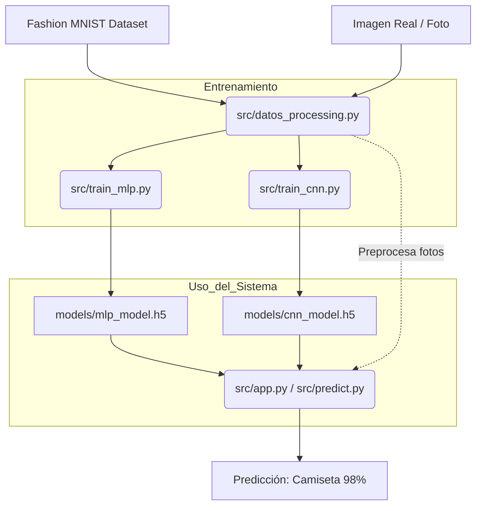

# Arquitectura del Proyecto — Fashion MNIST

Este documento explica cómo se relacionan los distintos componentes del sistema para que cualquier colaborador pueda entender el flujo de trabajo.

## 🏗️ Estructura y Responsabilidades

El proyecto está diseñado de forma modular para separar la **preparación de datos**, el **entrenamiento** y la **inferacción** (uso de los modelos).

### 1. El "Corazón": `src/datos_processing.py`
Este es el archivo más importante. **Todos** los demás scripts dependen de él.
- **Responsabilidad:** Cargar el dataset, normalizarlo y, lo más importante, transformar imágenes reales al formato exacto que el modelo espera (28x28 píxeles, escala de grises, normalización).
- **Relación:** Es el proveedor de datos para los scripts de entrenamiento, predicción y la app.

### 2. Los "Entrenadores": `src/train_mlp.py` y `src/train_cnn.py`
- **Responsabilidad:** Definen la arquitectura de las redes (Básica vs Convolucional), realizan el entrenamiento y guardan el resultado.
- **Flujo:** 
    - Piden datos a `datos_processing.py`.
    - Generan un archivo de "cerebro" entrenado en la carpeta `models/`.

### 3. El "Probador": `src/predict.py`
- **Responsabilidad:** Permitir que un desarrollador pruebe una imagen rápida desde la terminal (CLI).
- **Flujo:** Carga un modelo de `models/` y usa `datos_processing.py` para entender la imagen.

### 4. La "Cara": `src/app.py`
- **Responsabilidad:** Es la interfaz web final para el usuario no técnico.
- **Flujo:** Presenta un entorno visual donde el usuario sube fotos y ve resultados en tiempo real. Utiliza internamente la misma lógica que `predict.py`.

---

## 📈 Flujo de la Información

---

## 🛠️ Guía Rápida para Colaboradores

> [!TIP]
> **¿Quieres añadir una nueva arquitectura?**
> Crea un `src/train_nuevo.py`, importa `load_and_prepare_all` de `datos_processing` y guarda tu modelo en `models/`. El sistema de predicción lo reconocerá fácilmente.

> [!IMPORTANT]
> **¿Modificaste la forma en que se normalizan los datos?**
> Hazlo **solo** en `datos_processing.py`. De esta forma, tanto el entrenamiento como la aplicación se actualizarán automáticamente y no habrá discrepancias de formato.

---

## ✅ Resumen de Archivos

| Archivo | Rol | ¿Cuándo ejecutarlo? |
| :--- | :--- | :--- |
| `src/datos_processing.py` | Utilidad | Nunca (es una librería interna). |
| `src/train_mlp.py` | Entrenamiento | Una vez para generar el modelo básico. |
| `src/train_cnn.py` | Entrenamiento | Una vez para generar el modelo avanzado. |
| `src/predict.py` | Test | Cuando quieras probar una imagen por consola. |
| `src/app.py` | Producción | Para mostrar el proyecto final o usarlo. |
| `notebooks/` | Laboratorio | Para investigar, graficar y experimentar. |
